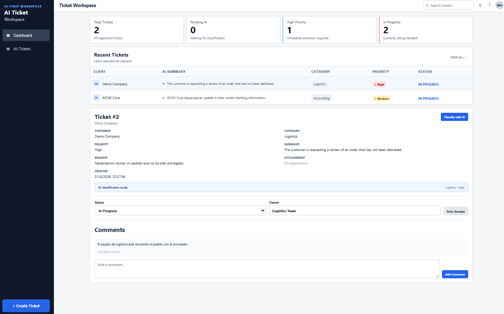
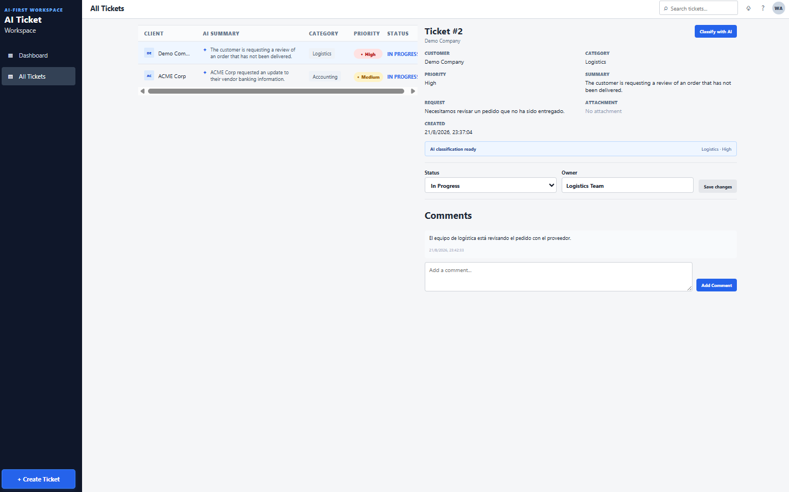

# AI Ticket Workspace

Espacio de trabajo para la gestión de tickets impulsado por IA.
Aplicación Full Stack desarrollada con React, Django REST Framework y PostgreSQL, con clasificación de tickets mediante IA y ejecución completa mediante Docker Compose.


## Descripción general

Flujo principal:

- Se crea un ticket con el nombre del cliente, la solicitud y opcionalmente una URL de archivo adjunto.
- Desde la aplicación se puede ejecutar la clasificación automáticamente con IA.
- La IA determina:
   - Categoría
   - Prioridad
   - Resumen corto
- El usuario puede actualizar el estado y asignar un responsable.
- También puede agregar comentarios al ticket.
- Revisa todos los tickets desde un panel de control dashboard.
- El ticket se guarda en PostgreSQL.

## Capturas

### Dashboard



### Gestión de tickets



## Stack tecnológico

### Frontend
- React
- Vite

### Backend
- Python
- Django
- Django REST Framework

### Database
- PostgreSQL

### AI
- Google Gemini API
- Gemini 3.5 Flash-Lite
- Structured output with Pydantic

### Infrastructure
- Docker
- Docker Compose

# Configuración del entorno

Crea un archivo local  `.env` a partir de `.env.example`.

El proyecto utiliza la variable `AI_PROVIDER` para definir cómo se realizará la clasificación de tickets.

## Modo mock

Por defecto se utiliza:
env
AI_PROVIDER=mock

Este modo permite ejecutar y probar todo el flujo de la aplicación de forma local y gratuita, sin necesidad de una clave de API externa.

## Modo Gemini

Cuando se dispone de una clave de API de Gemini funcional, se puede cambiar a:

AI_PROVIDER=gemini

y proporcionar la clave:

GEMINI_API_KEY=your_gemini_api_key

En este modo, la clasificación se realiza mediante Google Gemini.

Ejemplo de .env

# Proveedor de IA utilizado por la aplicación.
# mock = modo local/demo sin credenciales externas.
# gemini = clasificación real utilizando Gemini.
AI_PROVIDER=mock

POSTGRES_DB=ai_ticket_workspace
POSTGRES_USER=postgres
POSTGRES_PASSWORD=postgres
POSTGRES_HOST=db
POSTGRES_PORT=5432

DJANGO_DEBUG=True
DJANGO_SECRET_KEY=change-me-in-production

GEMINI_API_KEY=your_gemini_api_key

## Requisitos

La única dependencia local necesaria para ejecutar el proyecto es:

Docker Desktop

Docker Desktop proporciona el entorno de Docker Engine y Docker Compose que utiliza la aplicación.

# Ejecuta el proyecto

- Clona el repositorio:

git clone https://github.com/YOUR_USERNAME/ai-ticket-workspace.git
cd ai-ticket-workspace

- Crea el archivo de entorno:

Copy-Item .env.example .env

- Por defecto, el proyecto utiliza el modo local:

AI_PROVIDER=mock

Este modo no requiere una clave de API y permite probar gratuitamente el flujo completo de la aplicación.

- Si deseas utilizar clasificación real con Gemini, abre el archivo .env y cambia:

AI_PROVIDER=mock

por:

AI_PROVIDER=gemini

y añade una clave de API válida:

GEMINI_API_KEY=your_real_gemini_api_key

- Luego, inicia la aplicación:

docker compose up --build

- La solicitud estará disponible en:

Frontend:
http://localhost:5173

Backend:
http://localhost:8000

API:
http://localhost:8000/api/tickets/

- Las migraciones de base de datos se ejecutan automáticamente cuando se inicia el contenedor del backend.

# Primera prueba

Tras iniciar la aplicación:

Abre el frontend.
Haz clic en + Crear ticket.
Introduce el nombre del cliente.
Añade la descripción de la solicitud.
Opcionalmente, proporciona una URL de archivo adjunto.
Crea el ticket.
Abre los detalles del ticket.
Haz clic en Clasificar con IA.
Revisa la categoría, la prioridad y el resumen generados.
Actualiza el estado y el responsable.
Añade un comentario.

La clasificación funcionará de la siguiente manera:

Con AI_PROVIDER=mock

La aplicación utiliza reglas locales de demostración y no requiere una API externa.

Con AI_PROVIDER=gemini

La aplicación utiliza Google Gemini para realizar la clasificación real.

# Docker setup

docker-compose.yml, backend/Dockerfile, frontend/Dockerfile, backend/entrypoint.py

El proyecto utiliza tres servicios de Docker:

frontend
backend
db

## Architecture

El frontend se encarga de la interfaz de usuario y de la comunicación con el backend.

Django REST Framework expone la API y gestiona la lógica de la aplicación.

PostgreSQL se utiliza como almacén de datos principal.

La integración con la IA está aislada en un servicio dedicado, de modo que la lógica de los tickets no dependa directamente del proveedor de IA.

La integración de la IA reside en:

backend/tickets/services/ai_classifier.py

El servicio de clasificación permite utilizar dos proveedores:

AI_PROVIDER=mock
AI_PROVIDER=gemini

El modo mock está pensado para desarrollo local, demostraciones y pruebas sin depender de servicios externos.

El modo gemini permite utilizar la clasificación real mediante Google Gemini.

La categoría y la prioridad están restringidas a valores predefinidos para evitar que la IA introduzca valores inconsistentes en el sistema.

El backend guarda el resultado de la clasificación en PostgreSQL una vez validada la respuesta de la IA.

El ticket se guarda antes de la clasificación. Esto significa que, si el proveedor de IA no está disponible temporalmente, el ticket no se pierde.

```text
                ┌─────────────────────┐
                │       React         │
                │      Frontend       │
                └──────────┬──────────┘
                           │
                        HTTP/JSON
                           │
                           ▼
                ┌─────────────────────┐
                │    Django + DRF     │
                │       Backend       │
                └──────┬────────┬─────┘
                       │        │
                       │        │ AI classification
                       │        ▼
                       │   ┌─────────────────────┐
                       │   │  AIClassifierService│
                       │   └──────────┬──────────┘
                       │              │
                       │        ┌─────┴─────┐
                       │        │           │
                       │        ▼           ▼
                       │      Mock       Gemini API
                       │                  3.5 Flash-Lite
                       │
                       ▼
                ┌─────────────────────┐
                │     PostgreSQL      │
                └─────────────────────┘
